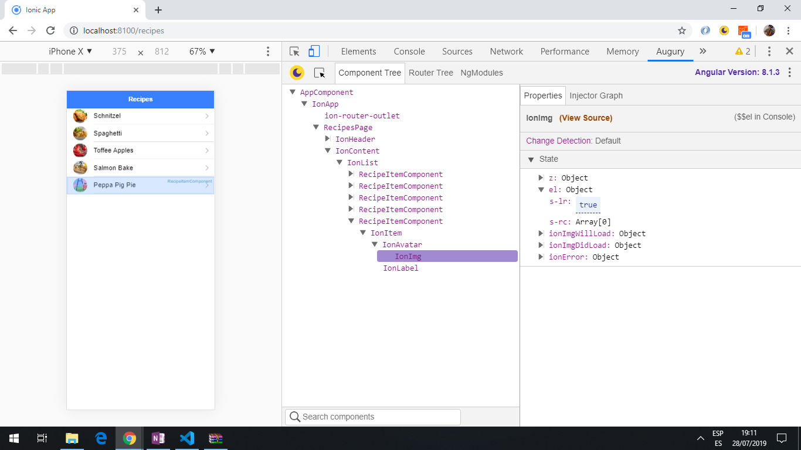
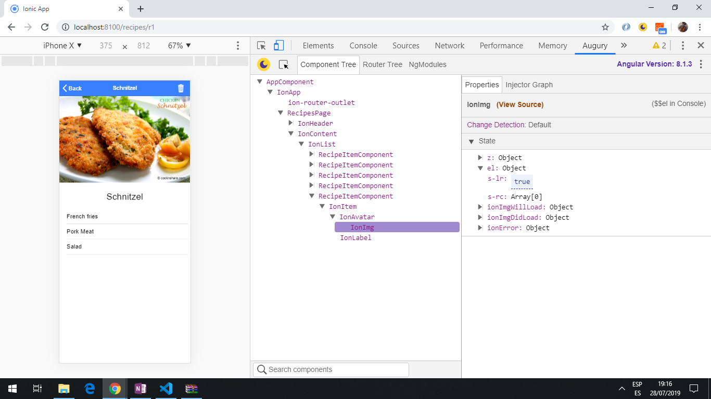

# :zap: Ionic Angular Notes

* App to show recipes as a list and in a detailed view, using the [Ionic 5 framework](https://ionicframework.com/docs).
* **Note:** to open web links in a new window use: _ctrl+click on link_


## :page_facing_up: Table of contents

* [:zap: Ionic Angular Notes](#zap-ionic-angular-notes)
  * [:page_facing_up: Table of contents](#page_facing_up-table-of-contents)
  * [:books: General info](#books-general-info)
  * [:camera: Screenshots](#camera-screenshots)
  * [:signal_strength: Technologies](#signal_strength-technologies)
  * [:floppy_disk: Setup](#floppy_disk-setup)
  * [:computer: Code Examples](#computer-code-examples)
  * [:cool: Features](#cool-features)
  * [:clipboard: Status & To-do list](#clipboard-status--to-do-list)
  * [:clap: Inspiration](#clap-inspiration)
  * [:file_folder: License](#file_folder-license)
  * [:envelope: Contact](#envelope-contact)

## :books: General info

* The Home page is a list of recipes. Click on one and it shows the detailed recipe page using the recipe id.
* The back button routes the user back to the home screen.
* The delete button deletes the recipe with an alert appearing
* Capacitor installed so app can be run on android.

## :camera: Screenshots




## :signal_strength: Technologies

* [Ionic v5](https://ionicframework.com/)
* [Ionic/angular v5](https://ionicframework.com/)
* [Angular framework v12](https://angular.io/)
* [Capacitor framework v3](https://capacitor.ionicframework.com/)
* Ionic DevApp, to allow app to run on an iOS or Android device.

## :floppy_disk: Setup

* Run `npm i` to install dependencies
* To start the server on _localhost://8100_ type: 'ionic serve'
* The Ionic DevApp was installed on an Android device from the Google Play app store.

## :computer: Code Examples

* functions to search for info and retrieve more detailed info.

```typescript
getAllRecipes() {
  return [...this.recipes];
}
// return a single recipe for an id
getRecipe(recipeId: string) {
  return {
    ...this.recipes.find(recipe => {
      return recipe.id === recipeId;
    })
  };
}

// delete a recipe using the filter function and recipe id
  deleteRecipe(recipeId: string) {
    this.recipes = this.recipes.filter(recipe => {
      return recipe.id !== recipeId;
    });
}
```

## :cool: Features

* [Ionic Capacitor](https://capacitor.ionicframework.com/) used to build the web app for Android.

## :clipboard: Status & To-do list

* Status: Working. Passes linting. Updated may 2021.
* To-do: change data in `recipes.services.ts`. Add functionality. run in Android simulator.

## :clap: Inspiration

* [Acadamind Udemy Course: Ionic 4 - Build iOS, Android & Web Apps with Ionic & Angular](https://www.udemy.com/ionic-2-the-practical-guide-to-building-ios-android-apps/)

## :file_folder: License

* This project is licensed under the terms of the MIT license.

## :envelope: Contact

* Repo created by [ABateman](https://github.com/AndrewJBateman), email: gomezbateman@yahoo.com
