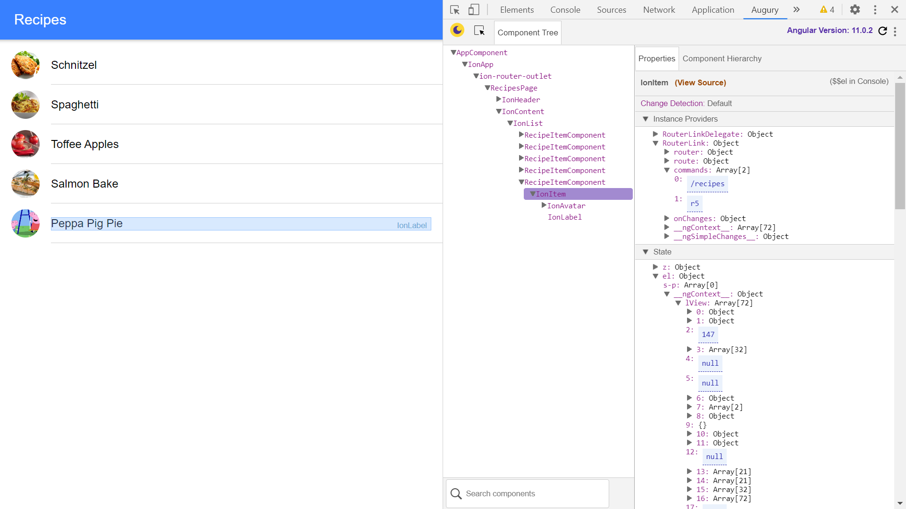

# Ionic Angular Notes

App to show recipes as a list and in a detailed view, using the [Ionic 4 framework](https://ionicframework.com/docs).

## Table of contents

* [General info](#general-info)
* [Screenshots](#screenshots)
* [Technologies](#technologies)
* [Setup](#setup)
* [Features](#features)
* [Status](#status)
* [Inspiration](#inspiration)
* [Contact](#contact)

## General info

Home page is a list of recipes. Click on one and it shows the detailed recipe page using the recipe id. Capacitor installed so app can be run on android.

## Screenshots



## Technologies

* Ionic/angular - version 4.0.0
* [Ionic Capacitor](https://capacitor.ionicframework.com/docs/) - version
* Ionic DevApp, to allow app to run on an iOS or Android device.

## Setup

* To start the server on _localhost://8100_ type: 'ionic serve'
* The Ionic DevApp was installed on an Android device from the Google Play app store.

## Code Examples

* functions to search for info and retrieve more detailed info.

```typescript
getAllRecipes() {
  return [...this.recipes];
}
// return a single recipe for an id
getRecipe(recipeId: string) {
  return {
    ...this.recipes.find(recipe => {
      return recipe.id === recipeId;
    })
  };
}

// delete a recipe using the filter function and recipe id
  deleteRecipe(recipeId: string) {
    this.recipes = this.recipes.filter(recipe => {
      return recipe.id !== recipeId;
    });
}
```

## Features

* [Ionic Capacitor](https://capacitor.ionicframework.com/) used to build the web app for Android.

* updated to latest ionic/angular versions. Dependencies updated and conflicts resolved.

## Status & To-do list

* Status: Working list of recipes, click on one and it shows the detailed recipe page via recipe id - see screen-print. Published to gh-pages

* To-do: change data in recipes.services.ts. Add functionality.

## Inspiration

Project inspired by [Acadamind's 'Ionic 4 & Angular Tutorial For Beginners - Crash Course'](https://www.youtube.com/watch?v=r2ga-iXS5i4).

## Contact

Created by [ABateman](https://www.andrewbateman.org) - feel free to contact me!